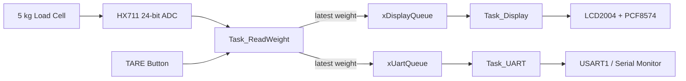

# STM32 FreeRTOS Electronic Scale

> STM32F103C8T6 · FreeRTOS · HX711 · 5 kg Load Cell · I²C LCD2004 · UART · TARE · Queue · Tickless Idle

A multitasking electronic scale built on the **STM32F103C8T6** using **FreeRTOS**.  
The system acquires load-cell data through the **HX711 24-bit ADC**, converts the raw measurement to kilograms, applies a deadband filter to reduce display jitter, supports **TARE**, displays the current weight on an **LCD2004**, and sends measurements through **UART**.

## Demo

[▶ Watch the electronic scale demo video](demo/electronic_scale_demo.mp4)

The demo shows the physical scale responding to applied loads and updating the measured weight in real time.

## Key Features

- 5 kg load cell measurement through the HX711 24-bit ADC
- Startup offset calibration and push-button TARE
- Anti-vibration / deadband filtering around zero
- FreeRTOS multitasking for acquisition, display, and UART output
- FreeRTOS Queue-based communication between producer and consumer tasks
- LCD2004 display through a PCF8574 I²C backpack
- UART output for serial monitoring
- Tickless Idle / deep-sleep hook for reducing CPU activity during idle periods
- Bare-metal STM32F1 peripheral configuration using the Standard Peripheral Library

## System Architecture



## FreeRTOS Task Design

| Task | Priority | Responsibility |
|---|---:|---|
| `Task_ReadWeight` | 3 | Read HX711, calculate weight, process TARE/deadband, publish data to queues |
| `Task_Display` | 2 | Receive latest weight from queue and update LCD/backlight |
| `Task_UART` | 1 | Receive latest weight from queue and transmit it over UART |

Two single-element queues are used:

```c
xDisplayQueue = xQueueCreate(1, sizeof(ScaleMessage_t));
xUartQueue    = xQueueCreate(1, sizeof(ScaleMessage_t));
```

`Task_ReadWeight` publishes the newest system state using `xQueueOverwrite()`.  
This keeps the modules decoupled and prevents a slow consumer from building a backlog of old measurements.

## Measurement Flow

```text
Load Cell
   ↓
HX711 raw 24-bit sample
   ↓
Startup/TARE offset subtraction
   ↓
Deadband filter
   ↓
Scale conversion
   ↓
Weight in kg
   ↓
FreeRTOS Queues
   ├──→ LCD2004
   └──→ UART
```

The firmware performs sign extension on the 24-bit HX711 result before processing it as a signed value.

A small deadband is applied near zero:

```c
if ((raw > -HX711_DEADBAND) && (raw < HX711_DEADBAND))
    w = 0.0f;
```

This reduces small fluctuations when the scale is unloaded.

## TARE Function

A push button is used to reset the current load as the new zero reference.

The button is debounced in software, and the firmware updates `hx_offset` from new HX711 samples.  
A TARE event is also sent to the display and UART tasks through the queue message.

## LCD and UART

The LCD2004 is connected through a **PCF8574 I²C backpack** at address `0x27`.

The display task updates the measured value in kilograms, while the UART task provides serial output such as:

```text
W=0.250 kg
W=0.500 kg
W=1.000 kg
```

## Tickless Idle / Low-Power Hook

The project includes `PreSleepProcessing()` and `PostSleepProcessing()` hooks for FreeRTOS Tickless Idle operation.  
The pre-sleep hook enters deep sleep using `SLEEPDEEP` and `WFI`, allowing the CPU to reduce activity when no task is ready to run.

The FreeRTOS project configuration should enable Tickless Idle, for example:

```c
#define configUSE_TICKLESS_IDLE 1
```

## Repository Structure

```text
STM32-FreeRTOS-Electronic-Scale/
├── README.md
├── src/
│   └── main.c
└── demo/
    └── electronic_scale_demo.mp4
```

## Technologies

`Embedded C` · `STM32F103C8T6` · `FreeRTOS` · `Task` · `Queue` · `HX711` · `Load Cell` · `I²C` · `UART` · `LCD2004` · `PCF8574` · `Tickless Idle`

## Notes

- The scale factor in the source is a calibration value for the tested hardware setup and may need recalibration for another load cell or mechanical assembly.
- The project uses the STM32 Standard Peripheral Library rather than HAL.
- The demo video is included directly in the repository as project evidence.
